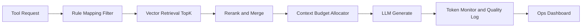

# 工具-KB 联通效率最优化落地蓝图（供执行 Agent 使用）

## 1. 文档目的

本文件用于指导执行 Agent 在现有系统上完成“工具与知识库联通效率”的第二阶段优化，并保证可验收、可回滚、可持续迭代。

目标不是大改重构，而是在两周内交付一套可上线、可量化收益的最优近似方案。

## 2. 当前基线（已完成）

- 已有 `kbService`：按 `toolCode + memberLevel` 做 KB 映射与 section 切片。
- 已有 `tokenMonitor`：可统计 `today/summary/dashboard`。
- 已有前端“生成参数与知识来源”展示。
- 已知不足：检索仍是规则映射与截断，缺少语义检索、质量评测闭环、自动压测基线。

## 3. 最终交付定义（Definition of Done）

执行完成后，必须同时满足：

1. 检索质量：在标准评测集上，答案相关性分数较当前基线提升 >= 20%。
2. 成本效率：同等问题集下，平均 token 消耗下降 >= 15%，且回答完整度不下降。
3. 稳定性：关键接口错误率 <= 1%，P95 响应时间可观测且有基线报告。
4. 可运营：按工具维度可查看调用量、成本、成功率、会员分层转化。
5. 可回滚：每个阶段有开关，可一键回退到当前映射方案。

## 4. 目标架构图

## 5. 执行分期与步骤

### Phase A（第 1-2 天）: 可观测性补全

#### A1. 增加工具级效果日志

- 在生成链路中新增结构化日志字段：
  - `toolCode`
  - `memberLevel`
  - `kbFilesUsed`
  - `retrievalMode`（`mapping_only` 或 `mapping_plus_vector`）
  - `contextChars`
  - `inputTokens/outputTokens/totalCost`
  - `success/fail`
  - `durationMs`

#### A2. 增加质量反馈打点

- 每次生成结果附带 `traceId`。
- 前端新增“有帮助/无帮助”反馈接口并落库或落日志。

#### A3. 验收

- 通过接口调用 20 次后，日志中可按 `toolCode` 聚合统计。
- Dashboard 可看到至少 4 个新增维度：成功率、平均成本、平均时延、反馈正向率。

### Phase B（第 3-6 天）: 检索双通道升级

#### B1. 新增向量检索索引构建脚本

- 对 `knowledge-base/` 按段落切块，生成向量索引文件。
- 切块策略：
  - 每块 300-600 中文字符
  - 邻接重叠 80-120 字符
  - 携带元数据：`toolTags/industryTags/memberLevel/path/section`

#### B2. 运行时双通道检索

- 保留当前 `kb-mapping` 作为“硬过滤器”。
- 在过滤结果内执行向量检索 TopK（建议 K=6~10）。
- 再做轻量重排（关键词覆盖 + 路径权重 + 会员层级权重）。

#### B3. 回滚开关

- 新增环境变量：
  - `KB_RETRIEVAL_MODE=mapping_only|mapping_plus_vector`
  - `KB_VECTOR_TOPK=8`
  - `KB_MAX_CONTEXT_CHARS=4500`

#### B4. 验收

- 在 50 条标准问题集上对比：
  - `mapping_plus_vector` 的相关性分数提升 >= 20%。
  - token 成本不上升超过 10%（若上升，必须说明收益原因并可调参）。

### Phase C（第 7-9 天）: 动态预算与会员分层优化

#### C1. 动态上下文预算器

- 按 `memberLevel + toolComplexity + questionLength` 分配上下文预算。
- 参考策略：
  - `free/starter`: 1500-2500 chars
  - `pro`: 3000-4500 chars
  - `annual`: 4500-7000 chars

#### C2. 动态 max_tokens 策略

- 对“诊断类/方案类/表格类”区分输出 token 上限。
- 不允许统一固定值；必须按工具类型映射。

#### C3. 验收

- 同一问题集下，低会员成本下降且输出仍完整。
- 高会员输出深度明显提升（人工抽检通过率 >= 80%）。

### Phase D（第 10-12 天）: 评测与发布保障

#### D1. 建立标准评测集

- 3 个行业 * 每行业至少 20 条题，共 >= 60 条。
- 每条包含：输入、期望要点、禁忌输出、评分维度。

#### D2. 自动回归脚本

- 产出一个一键脚本，输出以下对比：
  - 成功率
  - 平均耗时
  - 平均 token
  - 平均成本
  - 相关性得分

#### D3. 发布门禁

- 若任一核心指标低于基线阈值，则阻断发布。

## 6. 文件级实施清单（执行 Agent 必做）

- 后端核心：
  - `backend/src/services/kbService.js`
  - `backend/src/services/engineRegistry.js`
  - `backend/src/services/tokenMonitor.js`
  - `backend/src/routes/generate.js`
  - `backend/src/routes/tokenMonitor.js`
- 配置：
  - `backend/src/config/kb-mapping.json`
  - `backend/.env.example`（新增开关说明）
- 评测与脚本：
  - `backend/scripts/build-kb-index.js`
  - `backend/scripts/eval-kb-retrieval.js`
  - `backend/scripts/regression-report.js`
- 前端：
  - `frontend/src/components/ToolDetail.vue`（反馈入口 + traceId 展示）

## 7. 提交规范（执行 Agent 必须遵守）

1. 每个 Phase 单独提交，禁止一次性大提交。
2. 每次提交信息必须包含：`phase`、`metric`、`rollback`。
3. 每次提交后立即更新当日进度文档：`.monkeycode/5月4日开发进度.md`。
4. 若影响线上行为，必须附带“回滚步骤”。

## 8. 验收模板（执行 Agent 提交给审核 Agent）

执行 Agent 完成后，必须提交以下内容：

1. 变更文件清单。
2. 指标对比表（改造前 vs 改造后）。
3. 60+ 标准题评测结果。
4. 风险与回滚方案。
5. 仍未解决的问题列表。

## 9. 审核标准（供最终审核使用）

- 功能正确：无接口回归，无关键 5xx。
- 指标达标：达到 DoD 五项阈值。
- 成本受控：不因“更准”导致不可控成本上升。
- 可持续：新增脚本与配置可复用，不依赖个人手工。
- 可回退：开关可立即切回 `mapping_only`。

## 10. 文件定位（给另一位 Agent）

请直接从以下路径开始执行：

`/workspace/.monkeycode/docs/kb-tool-optimal-rollout-blueprint.md`
