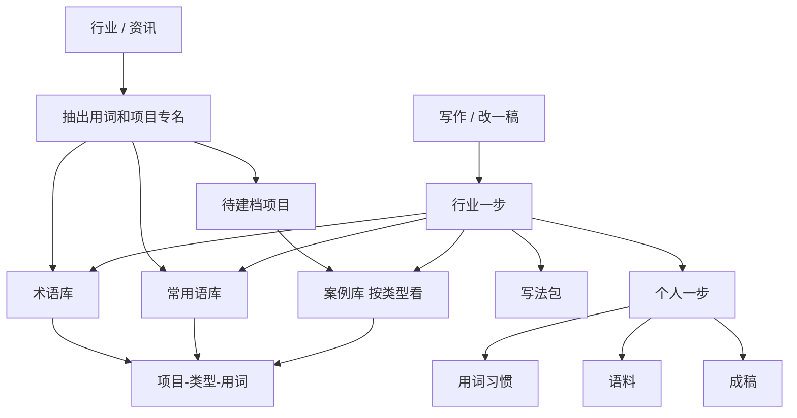

# 商业运营工作台

Feature Name: commercial-ops-workbench
Updated: 2026-09-12

## Description

把现有个人表达工作台收口为商业运营专业工作台。第一期做用词、案例、出稿。实现面仍在 `当前工作区/personal-expression-preview/`：Node 22 单进程 HTTP、`node:sqlite`、静态页。主名称改为「商业运营工作台」。

出稿内部顺序固定为两步：先行业（写法包、术语、常用语、句式、按重复率写入案例口径），再个人（口气、个人常用词）。数字、专名、引用保持原值。

## Architecture



模型只读用户填写的 `USER_LLM_API_KEY`、`USER_LLM_BASE_URL`、`USER_LLM_MODEL`。密钥不入库、不回显。没接模型时按正文抽词，标明这是按出现次数先挑。

## Components and Interfaces

### 侧栏

`app.js` 的 `pages` 改为分组渲染，一级是分组标题，二级是可点的页。案例页用查询参数 `?type=` 作为三级。

| 一级 | 二级 | 文件 |
| --- | --- | --- |
| 写作 | 改一稿 | `rewrite.html` |
| 写作 | 写法包 | `skills.html` |
| 行业 | 资讯 | `industry.html` 收口为资讯入口 |
| 行业 | 术语 | `terms.html` |
| 行业 | 常用语 | `phrases.html` |
| 行业 | 案例 | `cases.html` |
| 个人 | 语料 | `voice.html` |
| 个人 | 用词习惯 | `habits.html` |

Logo 与首页标题改为「商业运营工作台」。首页说明改成：先养行业资讯，再改一稿。

### 资源种类

沿用 `resources` 表，新增或收口 kind：

| kind | 作用 |
| --- | --- |
| `article` | 一篇资讯正文、来源链接、抽出的候选 |
| `context` | 收口为商业运营用词库，固定 `domain: commercial-ops` |
| `project` | 项目档 / 案例 |
| `sample` | 个人语料，不变 |
| `skill` | 写法包，不变 |

`SCHEMA_VERSION` 升到 7。已有行业包写入 `domain: commercial-ops`，不删词。

### 商业类型

固定四项：`nonstandard` 非标商业、`curated` 策展式商业、`cluster` 集中商业、`department` 传统百货。资讯、用词、项目档都可带 `commercialTypes` 数组。

### 抽词与重复率

`POST /api/industry/semantic-extract` 继续承担取正文和抽词，请求带 `packId`。响应增加 `projects[]`：正文里出现的项目专名、本篇次数、跨篇 `articleCount`。

同一资讯用 `seenArticles` 去重。跨篇重复率记在 `termHits` 与项目档的 `articleCount`。单篇不设展示条数上限，服务端最多保留 200 条候选以防撑爆。

抽出的词和项目默认不勾选。收下后才写入术语、常用语或项目档。

### 案例

| 方法 | 路径 | 作用 |
| --- | --- | --- |
| GET | `/api/projects` | 列出项目档，可按 `type`、`status=candidate|accepted` 过滤 |
| POST | `/api/projects` | 收下项目档：名称、商业类型、特征摘要、相关用词、来源资讯 |
| GET | `/api/projects/{id}` | 读单个项目档及来源资讯 |
| PATCH | `/api/projects/{id}` | 改类型、特征、用词 |
| GET | `/api/industry/links` | 读「项目 — 商业类型 — 用词」对应关系 |

`articleCount >= 2` 的项目列为案例候选。

### 出稿

`POST /api/rewrite/generate` 增加 `applyIndustryPass`。内部顺序：

1. 写法包规则（若勾选）
2. 已收下术语和常用语
3. 按重复率选出的相关案例口径
4. 若 `applyStyle===true`：用词习惯和语料
5. 数字、专名、引用锁定

成稿下列出实际用到的案例名称。相关案例按正文命中的用词和项目专名检索，按 `articleCount` 排序后自动写入，不再单独勾选案例。

## Data Models

```text
article = {
  id, title, body, url, commercialTypes[],
  termHits{}, projectNames[], fetchedFrom, domain: "commercial-ops"
}

termEntry = { term, kind: "term"|"phrase", articleCount, commercialTypes[], status: "accepted" }

project = {
  id, name, commercialTypes[], features, terms[], articleIds[],
  articleCount, status: "candidate"|"accepted", domain: "commercial-ops"
}

link = { projectId, commercialType, term, articleCount }
```

用词库仍存在 `context.terms` / `context.phrases`，并保留 `termHits`、`seenArticles`。

## Correctness Properties

1. 抽出的术语和常用语必须是资讯正文的子串。
2. 同一资讯重复抽取时，`termHits` 与 `articleCount` 保持不变。
3. `articleCount >= 2` 的项目出现在案例候选列表。
4. `commercialTypes` 的每一项都在四类枚举内。
5. 出稿时行业一步的提示词出现在个人口气提示词之前。
6. 成稿保留原文中的数字。
7. 本机、内网、`file://` 链接返回 400。

## Error Handling

- 公开链接取失败：提示把正文贴进来。
- PDF / Word：提示另存 txt 或 Markdown。
- 未接模型：按出现次数抽词，文案写明不是模型抽出的。
- 未选样稿意图：出稿 400。
- 案例候选未收下：出稿只使用已收下的项目档。

## Test Strategy

在 `test-api.js` 增加：抽词子串、跨篇重复率、同文不重复计数、项目升候选、四类过滤、出稿两步顺序、数字锁定、SSRF。页面断言覆盖新侧栏名称和「商业运营工作台」。

## References

[^1]: (Filename) - 需求文档 `.monkeycode/specs/commercial-ops-workbench/requirements.md`
[^2]: (Filename) - 现有预览工程 `personal-expression-preview/`
