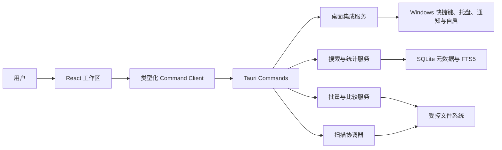

# 知档生产力增强技术设计

Feature Name: `document-index-productivity-enhancements`
Updated: 2026-07-28
Status: Confirmed for implementation planning

## Description

本设计在现有 Tauri 2、React、Rust 和 SQLite 架构上增加 12 项生产力能力。实现继续使用类型化 Tauri command 边界；界面偏好由统一设置模型管理；需要权威聚合、批量文件校验、扫描调度和版本比较的能力由 Rust 服务承担；搜索历史只保存在本机界面偏好中；预览和比较正文只存在于短期会话内。

实施采用连续序列，先建立共享偏好和桌面生命周期基础，再增强搜索与批量工作流，随后增加调度、统计、拖放、格式与比较能力，最后接入开机自启和完整备份兼容。托盘关闭行为默认启用，扫描计划与开机自启默认关闭。

## Architecture



### Runtime Boundaries

- 全局快捷键、托盘、通知和开机自启只在 `desktop-app` feature 下注册。
- 所有批量文件操作继续按文档 ID 解析路径并复用来源边界与实时可用性校验。
- 搜索高亮由后端返回纯文本片段和命中范围，前端不渲染后端 HTML。
- 扫描计划只调度现有 `ScanCoordinator`，不会建立第二套扫描执行器。
- 统计查询只聚合 SQLite 元数据，不读取文件正文。
- 格式预览和版本文本比较使用现有预览限制，并在会话结束后释放内容。

## Components and Interfaces

### Preference Contract

扩展 `BackupPreferences` 并新增统一前端偏好模块：

```typescript
interface ProductivityPreferences {
  globalSearchShortcut: string;
  closeToTray: boolean;
  scanSchedule: ScanSchedule;
  notificationsEnabled: boolean;
  autostartEnabled: boolean;
}

type ScanSchedule =
  | { enabled: false }
  | { enabled: true; mode: "daily"; localTime: string }
  | { enabled: true; mode: "interval"; intervalHours: 6 | 12 | 24 };
```

前端负责即时设置状态，Rust 负责桌面插件状态、扫描调度和备份值域校验。历史备份通过 serde 默认值补齐关闭状态。

### Shortcut and Window Lifecycle

- `ShortcutService` 注册默认 `Ctrl+Shift+F`，响应后显示主窗口并发出聚焦搜索事件。
- `App` 统一处理 `Ctrl+K`、`Ctrl+1..5` 和 `Escape`，并通过显式 UI 状态决定 Escape 优先级。
- `TrayService` 创建“显示主窗口”“立即扫描”“退出”菜单，拦截窗口关闭事件并隐藏窗口。
- 明确退出路径设置进程级退出标志，确保托盘退出不会再次触发隐藏逻辑。

### Search History and Highlighting

- `searchHistoryPreference.ts` 安全维护最多 20 条规范化历史项，重复查询提升到首位。
- `SearchRepository` 为 FTS 查询返回字段级纯文本匹配片段，命中范围使用字符偏移数组表达。
- `SearchWorkspace` 渲染历史弹层、清除操作和 `<mark>` 高亮；无片段时保留现有主题摘要。

### Batch Operations

新增 `BatchFileService` 和 commands：

```typescript
batch_copy_paths(documentIds: string[]): BatchOperationResult;
batch_reveal_documents(documentIds: string[]): BatchOperationResult;
export_document_metadata(documentIds: string[], targetPath: string): ExportResult;
```

服务逐项复用 `ShellService` 校验，返回成功 ID、失败 ID 与稳定错误摘要。CSV 使用 UTF-8 BOM、RFC 4180 转义和固定中文列顺序。

### Scan Scheduler and Notifications

- `ScanScheduler` 持有下一次执行时间和单 worker，时间到期后调用现有全源扫描入口。
- 活动扫描存在时记录跳过状态并计算下一次执行时间。
- 扫描完成事件由 `NotificationService` 转换为系统通知；权限或发送失败只影响通知状态。

### Statistics Dashboard

新增 `IndexStatistics` DTO、`StatisticsRepository` 和 `get_index_statistics` command。查询在单次数据库读取边界内返回总量、总大小、更新时间及以下聚合：来源、扩展名、可用状态、归组置信度。前端新增“统计”工作区，使用可访问表格与本地 SVG/CSS 图形，并提供跳转搜索筛选的操作。

### Drag and Drop Sources

`SourceManager` 订阅 Tauri 文件拖放事件，只接收目录路径并逐项调用现有 `add_source` command。前端显示拖放覆盖层、成功数量、忽略文件数量和逐项错误；成功来源继续触发首次扫描。

### Extended Format Adapters

- 默认扩展名迁移增加 ODT、ODS、ODP、EPUB、EML、SVG、XML、YAML、YML 和 TOML。
- ODF 与 EPUB 复用有界 ZIP/XML 读取器，使用独立条目白名单。
- EML 使用有界头部与文本正文解析，不加载远程资源或附件正文。
- SVG 以禁用脚本和外部资源的方式渲染；XML、YAML、YML、TOML 走安全文本预览。
- 新增格式进入现有文件类型族映射，保持归组评分稳定。

### Version Comparison

新增 `ComparisonService` 和短期 `ComparisonSession`。所有格式返回元数据差异；TXT、Markdown、CSV、JSON、XML、YAML、YML、TOML 和 EML 文本正文在总字节与总行数限制内生成逐行差异。其他格式返回两个预览入口。前端在 `TopicDetailPanel` 限制恰好选择两个版本后启用比较，并在独立比较面板展示结果。

### Autostart

`AutostartService` 使用当前用户级 Tauri autostart 插件。设置默认关闭；自启参数包含隐藏启动标志，桌面初始化据此跳过主窗口显示并直接进入托盘。设置失败时保持插件实际状态并回写界面。

## Data Models

| Model | Purpose | Persistence |
|------|---------|-------------|
| `ProductivityPreferences` | 快捷键、托盘、通知、调度和自启偏好 | 本机偏好与备份 JSON |
| `SearchHistoryEntry` | 查询词与最近使用时间 | localStorage |
| `SearchMatchSnippet` | 字段、纯文本片段和命中范围 | command 响应 |
| `BatchOperationResult` | 批量操作成功与失败摘要 | 临时响应 |
| `IndexStatistics` | 总量和分组统计 | 实时 SQLite 聚合 |
| `ComparisonSession` | 两版本元数据和有界文本差异 | 进程内短期会话 |

## Correctness Properties

1. **P1 历史有界与去重**：任意查询序列产生的搜索历史最多 20 条，按规范化查询词唯一，最近查询位于首位。（R2.1-R2.4）
2. **P2 高亮文本安全**：任意搜索输入产生的片段均以纯文本和有效字符范围返回，范围不会越过片段边界。（R2.5-R2.6）
3. **P3 批量操作隔离**：任意批量输入中单项失败不改变其他有效项的执行结果，结果 ID 集合与去重输入集合一致。（R3.1-R3.5）
4. **P4 CSV 往返完整**：任意受支持元数据字符串经 CSV 序列化和解析后保持字段值一致。（R3.3）
5. **P5 单扫描执行**：定时、托盘和手动入口并发触发时，同一来源最多存在一个活动扫描。（R4.3-R4.5、R5.2-R5.3）
6. **P6 调度确定性**：任意合法计划与当前时间产生唯一且严格晚于当前时间的下一次执行时间。（R5.2、R5.6）
7. **P7 统计守恒**：按来源、扩展名和可用状态聚合的文档计数分别等于统计快照的文档总数。（R6.1-R6.4）
8. **P8 拖放边界复用**：任意拖入路径只有通过现有来源可访问性与重叠校验后才进入来源集合。（R7.1-R7.4）
9. **P9 新格式正文零持久化**：任意新增格式扫描与预览后，数据库和备份均不包含正文标记。（R8.2-R8.5）
10. **P10 比较对称性**：交换两个版本只交换元数据左右值并反转文本新增与删除类别，未变化片段保持一致。（R9.2-R9.6）
11. **P11 偏好闭包**：任意持久化或恢复后的调度、快捷键和布尔偏好均属于已定义值域。（R10、R11）

## Error Handling

- 快捷键冲突：保持应用可用，设置页显示冲突并允许重新注册。
- 托盘初始化失败：主窗口关闭时执行普通退出，并显示桌面集成状态。
- 批量单项失败：返回逐项结果，不回滚已完成的无副作用操作。
- CSV 写入失败：保留目标文件写入前状态或删除仅由本次创建的临时文件。
- 计划触发时扫描繁忙：跳过本次执行并计算下一次时间。
- 通知权限拒绝：保留应用内结果，不影响扫描状态。
- 统计查询失败：保留其他工作区可用并显示重试入口。
- 新格式损坏或超限：返回现有 `limited` 预览状态。
- 比较内容受限：保留元数据比较并释放已创建的临时内容。
- 自启注册失败：重新读取系统实际状态并回写设置页。

## Test Strategy

- 前端组件测试覆盖快捷键分派、历史弹层、高亮、批量工具栏、托盘状态、设置表单、统计跳转、拖放反馈和比较面板。
- Rust 单元测试覆盖快捷键配置校验、调度时间计算、CSV 序列化、统计聚合、新格式解析和文本差异。
- Property-based tests 分别验证 P1-P11。
- 集成测试覆盖计划触发到扫描协调器、批量逐项校验、统计到搜索筛选、偏好备份往返和自启隐藏启动参数。
- Windows 条件测试使用可注入适配器隔离真实快捷键、托盘、通知、Shell 和自启副作用。

## References

- `当前工作区/.monkeycode/specs/local-document-index/requirements.md`
- `当前工作区/.monkeycode/specs/local-document-index/design.md`
- `当前工作区/document-index/src/app/App.tsx`
- `当前工作区/document-index/src/features/search/SearchWorkspace.tsx`
- `当前工作区/document-index/src/features/topics/TopicDetailPanel.tsx`
- `当前工作区/document-index/src/features/sources/SourceManager.tsx`
- `当前工作区/document-index/src/features/settings/BackupSettings.tsx`
- `当前工作区/document-index/src-tauri/src/services/scan_coordinator.rs`
- `当前工作区/document-index/src-tauri/src/services/preview_service.rs`
- `当前工作区/document-index/src-tauri/src/repositories/search.rs`
