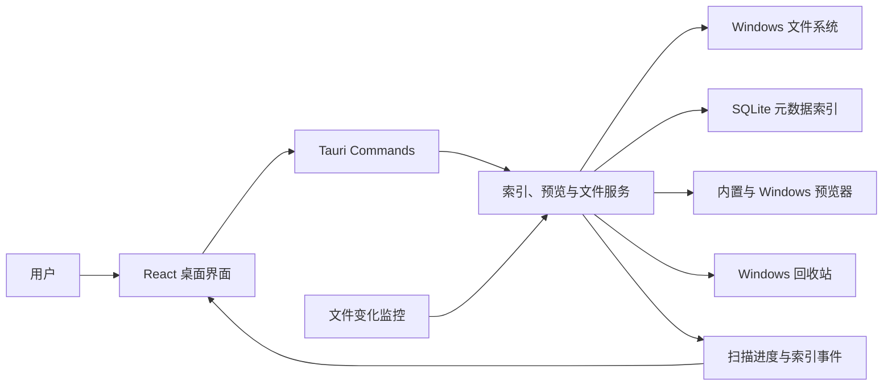
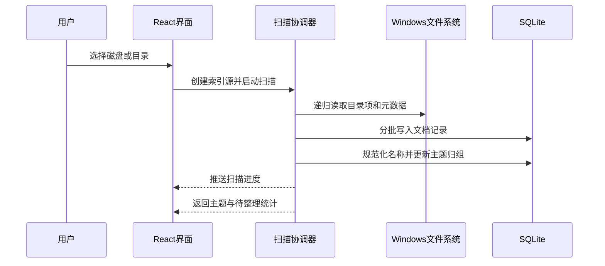
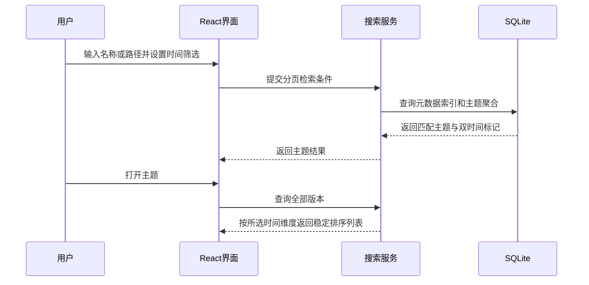
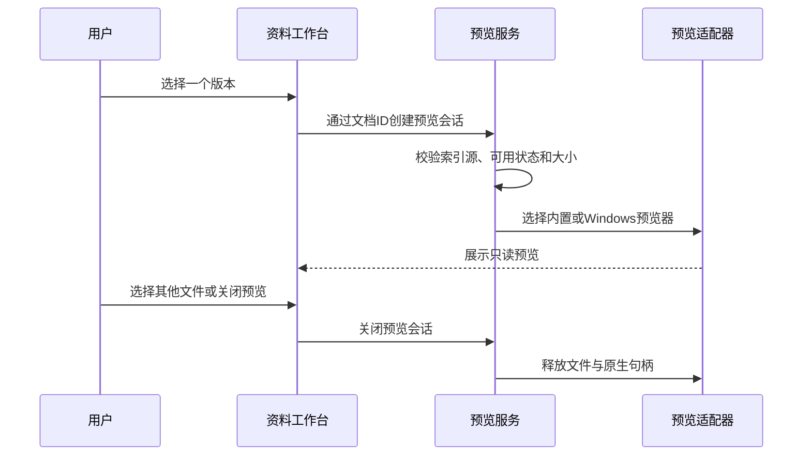

# 知档技术设计

Feature Name: `local-document-index`
Updated: 2026-07-24
Status: Confirmed for implementation

## Description

本功能新增一款 Windows 10/11 本地桌面应用，产品名为“知档”。应用扫描用户明确选择的磁盘或目录，仅采集文件系统元数据，并把分散在不同目录中的同主题文档聚合为版本组。搜索结果以主题为入口，主题详情同时呈现创建时间与最后修改时间两个版本维度。

技术方案采用 Tauri 2、React、TypeScript、Rust 和 SQLite。React 负责资料检索、主题浏览和人工整理；Rust 负责受控文件扫描、名称规范化、智能归组、文件变化监控和 Windows 文件操作；SQLite 负责本地持久化与元数据全文索引。该组合与当前仓库已有 Windows 桌面应用技术栈一致，可复用工程约定和构建经验。

## Architecture



### Runtime Boundaries

- WebView 仅访问经过注册的 Tauri commands，不直接获得任意文件系统读取权限。
- Rust 后端只扫描数据库中处于启用状态的索引源。
- SQLite 只保存文件元数据、主题关系、人工修正和扫描状态。
- 文件正文解析器不进入首版依赖和运行链路。
- 扫描与归组在后台工作线程执行，界面通过事件接收进度和结果变更。
- 预览内容按用户选择临时加载，预览会话结束后释放内存和原生预览句柄。
- 删除操作只调用 Windows 回收站能力，成功后再更新活动索引。

## Technology Stack

| Layer | Choice | Rationale |
|------|--------|-----------|
| Desktop shell | Tauri 2 | 提供 Windows 安装包、原生目录选择、Rust command 边界和较低资源占用 |
| Frontend | React 19 + TypeScript + Vite | 适合构建响应式检索、主题列表和详情交互 |
| Backend | Rust | 适合高并发目录遍历、元数据处理和长时间后台扫描 |
| Persistence | SQLite + FTS5 | 单机免配置，支持事务、索引和十万级元数据检索 |
| Directory traversal | `walkdir` | 递归遍历目录并逐项处理访问错误 |
| File watching | `notify` | 统一接收新增、修改、重命名和移除事件 |
| Database access | `rusqlite` | 与仓库现有 Tauri 项目保持一致并支持 bundled SQLite |
| Native dialog | `tauri-plugin-dialog` | 通过 Windows 原生对话框选择磁盘或目录 |
| Built-in preview | PDF.js + local format adapters | 本地只读预览 PDF、文本、Markdown、图片和新版 Office 文件 |
| Legacy preview | Windows `IPreviewHandler` | 复用已注册的 DOC、XLS、PPT 等系统预览处理程序 |
| Safe recycle | Windows recycle-bin adapter | 将文件移入回收站并保留恢复机会 |

## Suggested Project Structure

```text
document-index/
├── package.json
├── vite.config.ts
├── src/
│   ├── app/
│   ├── components/
│   ├── features/
│   │   ├── search/
│   │   ├── topics/
│   │   ├── sources/
│   │   ├── organize/
│   │   └── settings/
│   ├── lib/
│   └── styles/
└── src-tauri/
    ├── capabilities/
    ├── migrations/
    └── src/
        ├── commands/
        ├── domain/
        ├── repositories/
        ├── services/
        └── workers/
```

## UI Design

### Design Direction

界面采用“本地资料台账”视觉语言，强调密度、层级和长时间使用舒适度。基础色使用暖灰白与深墨色，主题强调色使用低饱和青绿色，时间与版本状态使用琥珀色。字体优先采用 Windows 系统字体，文件名、路径和时间保持清晰对齐。

### Main Layout

应用保持两栏主结构：左侧固定侧边栏，右侧完整资料工作区。工作区内部的结果列表与预览面板使用可拖动分隔线，属于同一工作区的主从视图。

```text
┌────────────────┬──────────────────────────────────────────────────────────┐
│ 知档           │ 搜索资料、文件名或路径                [筛选] [开始扫描] │
│                ├──────────────────────────┬───────────────────────────────┤
│ 搜索工作台     │ 主题与版本列表           │ 文件预览                      │
│ 全部资料       │                          │                               │
│ 待整理         │ 商业计划书        5 个版本│ 商业计划书 5.0.docx           │
│ 索引位置       │ 最新创建  07-24 14:30    │ [最近修改] [最新创建]         │
│                │ 最近修改  07-24 16:18    │                               │
│ ─────────────  │                          │ 文档只读内容                  │
│ 扫描状态       │ 版本列表                 │                               │
│ 82,416 个文件  │ 5.0  07-24 16:18        │                               │
│ 12 个待整理    │ 4.0  07-22 09:41        │                               │
│                │ 3.0  07-18 11:05        │                               │
│ 设置           │                          │ [默认程序打开] [所在目录]     │
└────────────────┴──────────────────────────┴───────────────────────────────┘
```

### Sidebar

- 宽度默认 224px，可折叠为 72px 图标栏。
- 一级入口包括搜索工作台、全部资料、待整理和索引位置。
- 底部持续展示扫描状态、已索引文件数、待整理数和设置入口。
- 当前入口使用整行色块和左侧状态线表达，降低仅依赖图标辨识的成本。

### Workspace

- 顶部 72px 区域承载统一搜索、位置筛选、创建时间、修改时间和扫描操作。
- 默认结果列表占工作区 42%，预览面板占 58%，分隔线允许拖动。
- 预览面板可折叠，也可扩展到工作区全宽。
- 主题卡片同时展示版本数、“最新创建”和“最近修改”，避免用单一“最新版”制造歧义。
- 版本行以时间为主信息，版本标签、类型、目录为辅助信息。

### Preview States

- 未选择：展示可预览格式和操作提示。
- 加载中：展示文件名、大小和分阶段加载反馈。
- 可预览：显示只读内容、缩放、页码或工作表切换。
- 预览受限：显示原因、文件信息、默认程序打开和所在目录。
- 文件缺失：显示索引路径和重新扫描入口。

### Recycle Interaction

- 删除入口位于版本行更多菜单和多选操作栏中。
- 确认对话框明确展示文件名、完整路径、数量和“文件将进入 Windows 回收站”。
- 主题级批量操作先展开受影响版本列表，再允许确认。
- 成功后显示轻量结果提示和“打开回收站”操作。

## Components and Interfaces

### Frontend Components

| Component | Responsibility |
|-----------|----------------|
| `SearchWorkspace` | 搜索输入、时间筛选、位置筛选、排序和主题结果列表 |
| `TopicList` | 展示主题名称、版本数、最新创建、最近修改和置信度状态 |
| `TopicDetail` | 展示主题内全部版本、双时间标记、路径和文件操作 |
| `SourceManager` | 添加、暂停、刷新索引源并展示扫描状态 |
| `OrganizeQueue` | 展示低置信度主题和系统合并建议 |
| `TopicEditor` | 主题重命名、合并和文档拆分 |
| `IndexStatusBar` | 展示扫描进度、文件数、失败数和最近完成时间 |
| `ExtensionSettings` | 管理默认与自定义扩展名白名单 |
| `PreviewPane` | 按需加载只读预览、格式工具栏、加载状态和系统打开兜底 |
| `RecycleConfirmation` | 展示待回收文件、路径、影响主题和确认结果 |

### Rust Services

| Service | Responsibility |
|---------|----------------|
| `SourceService` | 校验、保存和管理索引源 |
| `ScanCoordinator` | 调度全量扫描、增量扫描、取消和进度恢复 |
| `MetadataService` | 读取路径、名称、扩展名、大小和文件时间 |
| `NameNormalizer` | 分离扩展名、版本标记、副本标记和规范化文档名称 |
| `GroupingService` | 生成候选主题、评分、自动归组和待整理建议 |
| `SearchService` | 查询主题、过滤位置与时间、稳定排序和分页 |
| `WatchService` | 监听索引源变化并触发局部更新 |
| `TopicService` | 处理人工重命名、合并、拆分和规则优先级 |
| `ShellService` | 打开文件或在 Windows Explorer 中定位文件 |
| `PreviewService` | 创建短期预览会话、校验大小、选择预览适配器并释放资源 |
| `WindowsPreviewHost` | 承载已注册 `IPreviewHandler`，同步预览区域尺寸和生命周期 |
| `RecycleBinService` | 将选中文档移入 Windows 回收站并在成功后更新索引 |

### Tauri Commands

```typescript
type SourceId = string;
type TopicId = string;
type DocumentId = string;

interface SearchQuery {
  text: string;
  sourceIds: SourceId[];
  createdFrom?: string;
  createdTo?: string;
  modifiedFrom?: string;
  modifiedTo?: string;
  sortBy: "modifiedAt" | "createdAt" | "version" | "fileName";
  sortDirection: "asc" | "desc";
  page: number;
  pageSize: number;
}

interface TopicSummary {
  id: TopicId;
  displayName: string;
  documentCount: number;
  newestCreatedDocument?: DocumentSummary;
  recentlyModifiedDocument?: DocumentSummary;
  groupingConfidence: "manual" | "high" | "medium" | "low";
}
```

| Command | Input | Output |
|---------|-------|--------|
| `list_sources` | none | `IndexSource[]` |
| `add_source` | selected path | `IndexSource` |
| `set_source_enabled` | source ID, enabled | `IndexSource` |
| `start_scan` | source IDs | `ScanRun` |
| `cancel_scan` | scan ID | `ScanRun` |
| `get_scan_status` | scan ID | `ScanProgress` |
| `search_topics` | `SearchQuery` | paged `TopicSummary` |
| `get_topic_detail` | topic ID, sort | `TopicDetail` |
| `rename_topic` | topic ID, display name | `TopicDetail` |
| `merge_topics` | source topic IDs, target name | `TopicDetail` |
| `move_documents_to_topic` | document IDs, target topic | affected topics |
| `list_organize_suggestions` | paging | grouping suggestions |
| `update_extensions` | extension whitelist | normalized whitelist |
| `open_document` | document ID | operation result |
| `reveal_document` | document ID | operation result |
| `create_preview_session` | document ID, viewport | `PreviewSession` |
| `resize_preview_session` | session ID, viewport | operation result |
| `close_preview_session` | session ID | operation result |
| `recycle_documents` | document IDs, confirmation token | `RecycleResult` |
| `open_recycle_bin` | none | operation result |

Tauri 官方 command 模式使用 `tauri::State` 管理共享服务，并通过 `invoke` 在 React 与 Rust 之间传递序列化数据。目录选择使用 `tauri-plugin-dialog` 的 directory 模式。能力文件仅向主窗口授予对话框和必要 command 权限。[1]

预览会话使用随机短期 ID 关联已校验文档路径，前端不向预览 command 传入任意绝对路径。PDF、图片和新版 Office 适配器通过受控本地协议按需读取文件字节；文本、Markdown、CSV 和 JSON 使用大小受限的 UTF 解码。Windows Preview Handler 通过 `SetWindow`、`DoPreview`、`SetRect` 和 `Unload` 管理只读原生预览生命周期。[2]

## Name Normalization and Grouping

### Normalization Pipeline

1. 保留原始文件名和扩展名。
2. 对名称执行 Unicode 规范化、大小写归一和连续空白折叠。
3. 分离括号、下划线、短横线和空格连接的版本标记。
4. 识别数字版本、日期版本、副本标记和中文修订标记。
5. 清理剩余分隔符，得到规范化文档名称和名称关键词。
6. 生成阻塞键，限制模糊比较候选范围。

### Grouping Score

归组评分由以下元数据证据组成：

| Evidence | Weight |
|----------|--------|
| 规范化文档名称完全一致 | 最高 |
| 名称关键词集合相似度 | 高 |
| 字符串编辑相似度 | 高 |
| 存在可识别版本标记 | 中 |
| 扩展名属于同类文档 | 低 |
| 路径名称存在共同主题词 | 低 |

- 高置信度候选自动进入同一主题。
- 中置信度候选保留独立主题并进入待整理列表。
- 低置信度文档创建独立主题。
- 人工归组结果具有最高优先级，后续扫描通过稳定文件标识或路径关联继续沿用。
- 路径只作为辅助证据，确保不同 AI 输出目录中的同名版本仍可归组。

### Time Semantics

- `created_at` 保存 Windows 文件创建时间。
- `modified_at` 保存 Windows 文件最后修改时间。
- 每个主题分别计算 `newest_created_document_id` 和 `recently_modified_document_id`。
- 默认列表排序使用最后修改时间，用户偏好可切换到创建时间并持久化。
- 时间相同依次比较可排序版本、另一时间字段和规范化完整路径，保证结果稳定。

## Data Models

### `index_sources`

| Field | Type | Notes |
|------|------|-------|
| `id` | TEXT | UUID primary key |
| `path` | TEXT | normalized absolute path, unique |
| `display_name` | TEXT | user-facing name |
| `enabled` | INTEGER | scan and watch switch |
| `status` | TEXT | ready, scanning, unavailable, paused, error |
| `last_scan_at` | TEXT | nullable UTC timestamp |
| `last_success_at` | TEXT | nullable UTC timestamp |

### `documents`

| Field | Type | Notes |
|------|------|-------|
| `id` | TEXT | UUID primary key |
| `source_id` | TEXT | owning index source |
| `topic_id` | TEXT | current topic |
| `absolute_path` | TEXT | normalized absolute path |
| `file_identity` | TEXT | nullable Windows stable file identity |
| `file_name` | TEXT | original file name |
| `normalized_name` | TEXT | title after marker removal |
| `extension` | TEXT | lowercase extension |
| `version_label` | TEXT | original version marker |
| `version_sort_key` | TEXT | normalized sortable version |
| `size_bytes` | INTEGER | metadata only |
| `created_at` | TEXT | Windows creation time |
| `modified_at` | TEXT | Windows modification time |
| `availability` | TEXT | available, missing, inaccessible |
| `manual_topic` | INTEGER | manual assignment flag |
| `indexed_at` | TEXT | latest metadata refresh |

Unique constraint: `(source_id, absolute_path)`.

### `topics`

| Field | Type | Notes |
|------|------|-------|
| `id` | TEXT | UUID primary key |
| `canonical_name` | TEXT | system normalized name |
| `display_name` | TEXT | user-facing name |
| `display_name_manual` | INTEGER | protects manual rename |
| `grouping_confidence` | TEXT | manual, high, medium, low |
| `newest_created_document_id` | TEXT | dual time marker |
| `recently_modified_document_id` | TEXT | dual time marker |
| `created_at` | TEXT | record creation time |
| `updated_at` | TEXT | aggregate update time |

### Supporting Tables

- `grouping_suggestions`：候选主题、评分、证据和处理状态。
- `manual_grouping_rules`：人工合并、拆分和稳定文件归属规则。
- `scan_runs`：任务状态、游标、进度、数量和错误摘要。
- `scan_errors`：失败路径、错误类型、发生时间和重试状态。
- `extension_rules`：默认扩展名、自定义扩展名和启用状态。
- `topic_search`：SQLite FTS5 虚拟表，仅索引主题名、文件名、规范化名称和路径。
- `recycle_events`：记录文档 ID、原路径、操作时间、结果和错误类型，不保存文件正文。

## Key Flows

### Initial Scan



### Search and Version Display



### On-Demand Preview



## Correctness Properties

1. 每个活动文档记录归属于且仅归属于一个主题。
2. 人工主题归属优先于自动归组结果。
3. `newest_created_document_id` 指向主题内创建时间最新的可访问文档。
4. `recently_modified_document_id` 指向主题内最后修改时间最新的可访问文档。
5. 相同查询条件和数据库快照产生相同结果顺序。
6. 扫描索引字段不包含文档正文、正文摘要或正文向量。
7. 索引源之外的路径不进入扫描任务。
8. 单批扫描写入在事务中保持文档、主题聚合和搜索索引一致。
9. 取消扫描保留已提交批次，并将扫描运行标记为 cancelled。
10. 文件访问失败不终止同一扫描运行中的其他目录处理。
11. 预览正文不写入文档索引、搜索索引、日志或备份。
12. 同一预览面板最多保持一个活动预览会话。
13. 回收站操作成功后才改变文档可用状态和主题聚合。
14. 回收站操作失败时文档索引和主题聚合保持操作前状态。

## Error Handling

| Scenario | Handling |
|----------|----------|
| 索引源离线或磁盘移除 | 保留配置和索引，标记 unavailable，允许重试 |
| 目录权限不足 | 跳过失败目录，记录路径和系统错误码，继续扫描 |
| 文件扫描期间被移动 | 忽略当前元数据读取，交由变化事件或目录复扫处理 |
| 文件时间缺失 | 保存可用时间，界面显示未知，排序时置于已知时间之后 |
| 文件监听事件溢出 | 标记源需要校验并调度增量复扫 |
| SQLite 写入失败 | 回滚当前批次，记录扫描错误并提供继续入口 |
| 文件打开失败 | 保持索引记录，显示路径、可用状态和系统错误说明 |
| 人工合并发生冲突 | 在单个事务中校验文档归属并返回最新主题状态 |
| 预览器不支持文件类型 | 展示文件信息、默认程序打开和所在目录入口 |
| 预览文件超过大小限制 | 跳过内容加载，展示大小和系统打开入口 |
| Windows 预览处理程序缺失或崩溃 | 卸载预览会话并切换到系统打开兜底 |
| 文件移入回收站失败 | 保持活动索引不变，显示文件级错误结果 |

## Performance Design

- 目录遍历、元数据读取、名称规范化和数据库写入通过有界队列解耦。
- SQLite 使用 WAL、批量事务、预编译语句和必要字段索引。
- 搜索输入使用 200 毫秒防抖、FTS5 查询和固定分页上限。
- 智能归组先按阻塞键筛选候选，避免全量文档两两比较。
- 扫描通过路径、大小和文件时间判断元数据是否变化。
- 文件变化事件按目录和短时间窗口合并，降低重复更新。
- 主题时间标记在文档变化或人工归组后增量重算。

## Test Strategy

### Rust Unit Tests

- 文件名规范化覆盖数字版本、日期版本、中文标记、英文副本和无版本文件。
- 归组评分覆盖同名跨目录、高相似名称、低相似名称和人工规则优先级。
- 双时间排序覆盖创建时间领先、修改时间领先、时间相同和时间缺失。
- 路径校验覆盖重叠索引源、不可访问路径和索引源边界。

### Repository Tests

- 使用临时 SQLite 数据库验证迁移、事务、FTS5 同步和分页稳定性。
- 验证主题合并、文档拆分和双时间标记在同一事务中更新。
- 验证扫描取消、继续和错误记录持久化。

### Integration Tests

- 使用临时目录创建跨目录同主题多版本文件，验证扫描、归组、排序和检索闭环。
- 模拟新增、修改、重命名、移动和删除事件，验证局部索引更新。
- 验证默认扩展名与自定义扩展名规则。
- 验证应用只采集元数据字段。

### Frontend Tests

- 搜索筛选、分页、空状态和错误状态。
- 主题详情中的“最新创建”与“最近修改”标记。
- 排序维度切换和用户偏好恢复。
- 人工合并、拆分和主题重命名交互。
- 扫描进度、取消和失败路径摘要。
- 两栏主布局、工作区分隔线、预览折叠和全宽模式。
- 预览选择切换、资源释放、格式兜底和危险操作确认。

### Performance Tests

- 生成 100,000 条元数据记录，验证常用搜索在基线设备上 500 毫秒内返回。
- 使用深层目录和大量不支持扩展名文件验证扫描吞吐与界面响应。
- 验证大批文件变化事件经过合并后维持索引一致。

## Security and Privacy

- 应用离线运行，首版不包含网络请求和用户账户。
- Tauri capability 仅开放目录选择和受控 command 调用。
- Rust command 在执行文件操作前按数据库中的文档 ID 解析路径并重新校验归属索引源。
- 日志记录错误类型和路径摘要，产品日志设置允许用户控制完整路径记录。
- 备份只包含索引关系和设置，不复制原始文档。
- 预览只在用户明确选择文件后读取内容，内容不进入数据库和应用日志。
- Markdown 和文本预览按纯文本或经过清理的安全 HTML 渲染。
- Windows Preview Handler 保持系统低完整性隔离设置，不修改处理程序注册表配置。
- 回收站操作需要明确确认，Rust 后端按文档 ID 重新校验路径和文件状态。

## References

[1] Tauri 2 官方文档：Calling Rust、Dialog Plugin、Capabilities，`https://tauri.app/develop/calling-rust`、`https://tauri.app/plugin/dialog`、`https://tauri.app/learn/security/capabilities-for-windows-and-platforms`

[2] Microsoft Learn：Preview Handlers and Shell Preview Host，`https://learn.microsoft.com/en-us/windows/win32/shell/preview-handlers`
