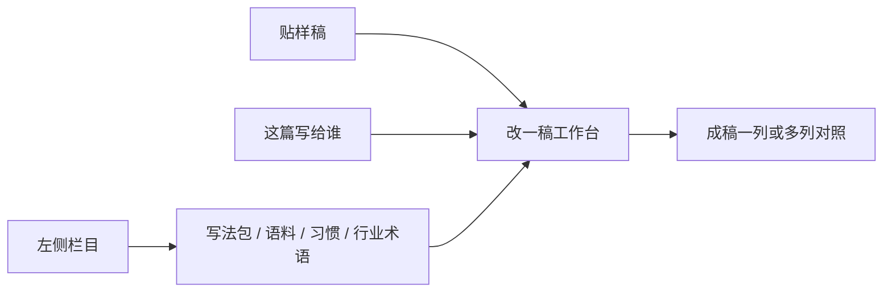

# 工作台自选工具改稿

Feature Name: multi-skill-deai-compare
Updated: 2026-09-11

## Description

改一稿是一张工作台：贴稿、点这篇写给谁、勾要用的工具、出稿。工具包括通用写法包、换成我的口气、换成行业用语。用户自己勾，界面不出现步骤条、「下一步」或向导。多套写法包勾上则各出一稿对照。同时勾了多层时，生成内部按去 AI、口气、行业用语叠加。行业包由用户自己起名和装满。主名称保持「个人表达工作台」。

## Architecture



现有 `personal-expression-preview` 单进程 HTTP + SQLite 继续作为实现面。`POST /api/rewrite/generate` 接收勾选：`skillIds`、`applyStyle`、`applyIndustry`、`industryPackId`、`intent`。

勾选多套写法包时，为每个 skillId 各开一条任务。`applyStyle` / `applyIndustry` 为 true 时，在该任务内部按叠加顺序注入对应层。页面只渲染勾选状态和成稿。

## Components and Interfaces

### 左侧栏目

首页、改一稿、我的语料、行业术语、用词习惯、写法包。写法包页只管理通用去 AI 包：名称、一句话用途、来源、启用。内置四套：清套路、中文去腔、说人话、轻改保结构。启用的包出现在改一稿的勾选区。

### 改一稿工作台

一块贴稿区，一块工具勾选区，一块成稿区。

工具勾选区：已启用的通用写法包多选；「换成我的口气」开关；「换成行业用语」开关及当前行业包。样稿意图点选：给领导的工作汇报、对外沟通、公众号长文、论文。未点选意图时出稿按钮不可用。

成稿区：一套写法包则一列；多套则并排，列上写写法包名称和规则说明。提供「收下这一版」。

文案用勾选、出稿、收下。不用步骤、流程、下一步。

### 行业术语页

用户自建行业包：自己起名，上传术语和习惯用语。改一稿的「换成行业用语」使用当前选中包。无包时开关可开，出稿后提示补包。

已收下的 6+7+8 语料和习惯留在个人层，以及用户若已命名的行业包里，不作为产品默认行业。

### API

| 方法 | 路径 | 作用 |
| --- | --- | --- |
| POST | `/api/rewrite/generate` | 传 `intent`、`skillIds`、`applyStyle`、`applyIndustry`、`industryPackId` |
| GET | `/api/skills` | 列出通用写法包 |
| POST | `/api/skills` | 启用或登记写法包 |
| GET | `/api/contexts` | 列出用户自建行业包 |
| POST | `/api/contexts` | 创建行业包，`name` 由用户填写 |

`buildSystemPrompt` 按勾选拼层：有 skillId 则只带该写法包规则；`applyStyle` 则带用词习惯和匹配语料；`applyIndustry` 则带行业包术语。数字锁定始终生效。

## Data Models

```text
RewriteBoard {
  intent, source,
  selectedSkillIds[],
  applyStyle, applyIndustry, industryPackId,
  results: [{ skillId, skillName, text, taskId }]
}

SkillPack {
  id, name, summary, source, rulesMarkdown,
  kind: generic-deai, enabled, builtin
}

IndustryPack {
  id, name, terms[], phrases[], owner
}
```

`SCHEMA_VERSION` 从 4 升到 5：`state.rewrite` 增加勾选字段；新增 `skills`；`contexts` 作为行业包。缺字段时按空值和内置四套补齐。

内置写法包规则以仓库内 Markdown 存放，启动时若库中无 builtin 记录则写入。外部 GitHub skill 本切片只预留 `source`，不自动安装。

## Correctness Properties

1. 未点选样稿意图时，系统不生成正文。
2. 界面不渲染步骤进度或「下一步」。
3. 生成结果只反映当前勾选的工具。
4. 多样稿对照只在勾选了多于一套通用写法包时出现。
5. 同时勾选多层时，生成按去 AI、口气、行业用语叠加。
6. 未勾选口气层时，prompt 不含个人风格规则。
7. 未勾选行业用语时，prompt 不含行业包术语。
8. 已锁定数字、专名、引用在输出中保持原值。
9. 行业包名称来自用户输入，系统不提供预置行业清单。
10. 主名称保持「个人表达工作台」。

## Error Handling

- 未配置模型且 `demoMode` 不为 true：返回现有 503 文案，引导用户填写自己的模型服务。
- 多列对照中某一写法包失败：该列显示失败原因，其余列可收下。
- 勾了行业用语但无行业包：允许出稿，提示补包后可再替换。
- 外部写法包未接入：列表标「未接入」，勾选区不可选。
- 事实锁定被改动：沿用 `factDiff`，在该列下展示缺/多的数字。

## Test Strategy

在 `test-api.js` 增加：

1. 未传 `intent` 时 generate 拒绝。
2. 两个 `skillIds` 时创建两条任务，prompt 含对应写法包规则。
3. `applyStyle=false` 时 prompt 不含用词习惯。
4. `applyIndustry=true` 时 prompt 含行业包术语。
5. 用户创建行业包时名称原样保存。
6. 内置四套写法包可列出且 `kind=generic-deai`。
7. 锁定数字在 demo 输出中保持原值。

验证命令：`npm test`、`npm run check`、`node --check server.js`。

## References

[^1]: (Filename) - 需求文档 `.monkeycode/specs/multi-skill-deai-compare/requirements.md`
[^2]: (Filename) - 现有改写 `personal-expression-preview/server.js`
[^3]: (Filename) - 页面交互 `personal-expression-preview/app.js`
