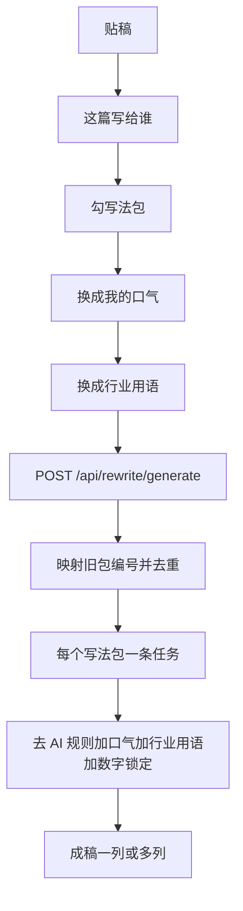

# 一个 skill 一个写法包

Feature Name: one-skill-one-writing-pack
Updated: 2026-09-11

## Description

在已上线的改一稿主链条上，把去 AI 层收口为「一个 skill 一个写法包」。开源规则在仓库内写成 Markdown，启动时写入当前用户的 builtin 记录。勾几个写法包，就为每个包开一条生成任务。口气层、行业用语层、数字锁定保持现有行为。

本切片改动集中在 `当前工作区/personal-expression-preview/`：内置包目录、`ensureBuiltinSkills`、出稿时的 skillId 映射与去重、界面文案。主名称保持「个人表达工作台」。

## Architecture



实现面仍是 Node 22 单进程 HTTP + `node:sqlite`。静态页由同一服务托管。模型调用继续只读用户填写的 `USER_LLM_API_KEY`、`USER_LLM_BASE_URL`、`USER_LLM_MODEL`；密钥不入库、不回显。

生成内部顺序：

1. 当前写法包的 `rulesMarkdown`
2. 若 `applyStyle===true`：已确认用词习惯 + 匹配语料
3. 若 `applyIndustry===true`：当前行业包术语
4. 已锁定数字、专名、引用

页面不渲染该顺序。

## Components and Interfaces

### 内置写法包目录

| 稳定 id | 界面名称 | 本地文件 | 来源仓库 | 一句说明 |
| --- | --- | --- | --- | --- |
| `skill-humanizer-zh` | 去 AI 腔 | `skills/humanizer-zh.md` | op7418/Humanizer-zh，并入 blader/humanizer | 去掉中文里常见的空话、翻译腔和宣传套话。 |
| `skill-stop-slop` | 去空话打分 | `skills/stop-slop.md` | hardikpandya/stop-slop | 删掉空话和套句，改完按是否清楚再检查一遍。 |
| `skill-no-ai-slop` | 先检查再少改 | `skills/no-ai-slop.md` | petergyang/no-ai-slop | 先标出套话，再尽量少改；能不动的句子不动。 |
| `skill-shuorenhua` | 说人话 | `skills/shuorenhua.md` | 工作台自有 | 去掉「赋能、抓手」这类包装词，写成具体的人和事。 |
| `skill-qinggaibaojiegou` | 只换说法 | `skills/qinggaibaojiegou.md` | 工作台自有 | 分段和标题保持原样，只把套话换成更清楚的句子。 |

退役映射：

| 旧 id | 旧名称 | 新 id |
| --- | --- | --- |
| `skill-qingtaolu` | 清套路 | `skill-humanizer-zh` |
| `skill-zhongwenquqiang` | 中文去腔 | `skill-humanizer-zh` |

旧 Markdown 文件保留在仓库中，不再登记进 `BUILTIN_SKILLS`。不删除用户库记录，只把 `retired: true`、`enabled: false` 写回，并从 `GET /api/skills` 默认列表排除。

`humanizer-zh.md` 由现有 `qingtaolu.md` 与 `zhongwenquqiang.md` 合并，并写明：给领导的工作汇报用「我方」，不把「注入灵魂 / 第一人称随笔」写进本包。规则用中文重写，不整篇复制上游 SKILL.md。

`stop-slop.md` 写中文禁句和自检：直接、具体、有人在做事、少公式对比句。正式意图（汇报、论文）保持书面判断句。

`no-ai-slop.md` 写三步：先列出套话 → 只改标出的句子 → 用短清单自检（声音还在、没有新编事实、破折号没有堆上）。

### 改一稿

勾选区仍读 `GET /api/skills`。列标题用 `name`，列内说明用 `summary`。多列对照只在映射去重后的 `skillIds.length > 1` 时出现。

「收下这一版」保持现有行为：剥掉演示标签，正文写回贴稿区。

文案：

- 工具区说明：勾一种改法，出一稿。勾几种，每种出一稿，方便比较。
- 写法包页说明：这里是改稿时可以勾选的改法。打开以后，改一稿页就能勾。
- 找不到写法包：这个改法还不能用。

### API

| 方法 | 路径 | 作用 |
| --- | --- | --- |
| GET | `/api/skills` | 列出未退役写法包 |
| POST | `/api/skills` | 启用/停用，或登记自定义包 |
| POST | `/api/rewrite/generate` | `intent`、`skillIds`、`applyStyle`、`applyIndustry`、`industryPackId`、`demoMode` |
| GET | `/api/tasks/{id}` | 读任务状态与成稿 |
| GET | `/api/contexts` | 行业包列表 |
| POST | `/api/contexts` | 创建行业包 |

`POST /api/rewrite/generate` 处理顺序：

1. 校验 `source`、`intent`。
2. `normalizeSkillIds`。
3. `mapRetiredSkillIds`：旧 id 换成新 id。
4. 按映射后的 id 去重，保持用户勾选顺序。
5. `skillIds.length > 1` 时为每个 id `enqueue({ ...input, skillIds: [id] })`，`202` 返回 `{ taskId, taskIds }`。
6. 长度为 0 或 1 时保持现有单任务响应。

每条任务的 `buildSystemPrompt`：

- 先写入该意图的场景说明。
- 只追加**当前这一条**写法包的 `rulesMarkdown`。
- `applyStyle===true` 才追加个人规则和语料。
- `applyIndustry===true` 才追加行业包。
- 数字锁定始终追加。
- 当 `intent` 为给领导的工作汇报，追加一句：对内口径用「我方」，不用随笔「我」。

`GET /api/skills` 在返回前调用 `ensureBuiltinSkills`：

- 目录中有、库中无：插入，`builtin: true`，`enabled: true`。
- 目录中有、库中有且 `builtin===true`：若 `name` / `summary` / `rulesMarkdown` / `sourceRepo` 与文件不一致则更新，保留 `enabled`。
- 退役 id：更新 `retired: true`、`enabled: false`，默认列表不返回。

`POST /api/skills` 只改 `enabled` 时禁止改写 builtin 的 `rulesMarkdown`。自定义包仍可带自己的 Markdown。

错误码保持现有风格：缺意图 `400`「先选这篇写给谁」；写法包映射后不存在 `400`「这个改法还不能用」；未配置模型且未 `demoMode` `503`。

### 前端

`app.js` `setupRewriteBoard`：勾选收集 `skillIds` 后出稿。本地 `selectedSkillIds` 经同一套映射函数去重，避免旧缓存勾出两列相同的「去 AI 腔」。

`data-model.js` `SCHEMA_VERSION` 升到 6：`migrate` 把 `rewrite.selectedSkillIds` 里的旧 id 换新并去重。

## Data Models

```text
SkillPack {
  id, name, summary,
  source: builtin | custom,
  sourceRepo,          // 如 op7418/Humanizer-zh，自有包为空串
  rulesMarkdown,
  kind: generic-deai,
  builtin, enabled, retired
}

GenerateInput {
  source, intent,
  skillIds[],          // 映射去重后每个 id 一条任务
  applyStyle, applyIndustry, industryPackId,
  demoMode
}

GenerateAccepted {
  taskId, taskIds[], status
}

TaskResult {
  candidate, systemPrompt, skillId, skillName,
  industryReplacements[], factDiff
}
```

资源仍存在 `resources` 表，`kind='skill'`。不单开技能表。

## Correctness Properties

1. 默认技能列表正好是 5 个未退役写法包，名称与目录表一致。
2. 英文 humanizer 没有单独 id，也不出现在勾选区。
3. 同一 `generate` 请求里，旧「清套路」与「中文去腔」最多变成一列「去 AI 腔」。
4. 一条任务的系统提示只含一份写法包规则。
5. `applyStyle` 不为 true 时，系统提示不含个人表达层。
6. `applyIndustry` 不为 true 时，系统提示不含行业包，且 `industryReplacements` 为空数组。
7. 已锁定数字在演示稿和模型稿中保持原值。
8. 界面文案不含「下一步」、步骤条、翻译腔、三段式、轻改保结构。
9. 给领导的工作汇报的系统提示含「我方」，去 AI 包正文不含「注入灵魂」。
10. 主名称保持「个人表达工作台」。

## Error Handling

- 未点选意图：`400`，出稿按钮保持不可用。
- 映射后写法包不存在或自定义包没有 `rulesMarkdown`：`400`「这个改法还不能用」。
- 多列中一列失败：该列显示失败原因，其余列可收下。
- 勾了行业用语但无行业包：允许出稿，提示补包。
- 未配置模型且 `demoMode` 不为 true：`503`，引导填写自己的模型服务。
- Markdown 文件缺失：`loadSkillMarkdown` 回退到 `summary`，包仍可列出。

## Test Strategy

在 `test-api.js` 覆盖：

1. `GET /api/skills` 返回 5 个名称：去 AI 腔、去空话打分、先检查再少改、说人话、只换说法；不含清套路、中文去腔。
2. 「去 AI 腔」的 `rulesMarkdown` 含「综上所述」和「至关重要」，不含「注入灵魂」。
3. `skillIds: ['skill-qingtaolu','skill-zhongwenquqiang']` 只创建 1 条任务，提示含「去 AI 腔」。
4. `skillIds` 含去 AI 腔与说人话时 `taskIds.length === 2`，两条提示各含对应包名。
5. 汇报意图的系统提示含「我方」。
6. `applyStyle=false` 时提示不含「个人表达」。
7. `applyIndustry=true` 且术语为 `客流→课时` 时，演示稿含课时，并返回 `industryReplacements`。
8. `rewrite.html` 含「勾一种改法，出一稿」；`skills.html` 含「改稿时可以勾选的改法」。

验证命令：`npm test`、`npm run check`。

## References

[^1]: (Filename) - 需求 `.monkeycode/specs/one-skill-one-writing-pack/requirements.md`
[^2]: (Filename) - 上一期工作台自选 `.monkeycode/specs/multi-skill-deai-compare/design.md`
[^3]: (Filename) - 预览服务 `personal-expression-preview/server.js`
[^4]: (Website) - Humanizer-zh https://github.com/op7418/Humanizer-zh
[^5]: (Website) - stop-slop https://github.com/hardikpandya/stop-slop
[^6]: (Website) - no-ai-slop https://github.com/petergyang/no-ai-slop
