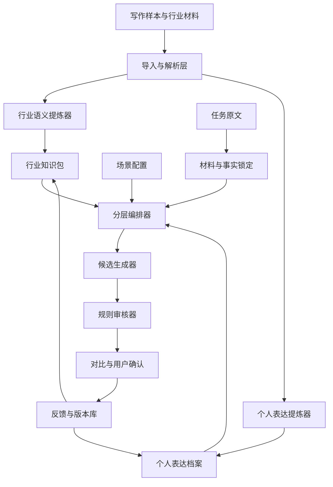

# 个人表达工作台技术设计

Feature Name: personal-expression-workbench
Updated: 2026-09-09

## 1. 设计原则

1. 行业知识回答“说什么”，个人表达档案回答“怎么说”。
2. 用户通过选择、修改和确认学习系统，系统不要求用户先写出文风说明书。
3. 事实、行业语义、个人表达和场景交付分层保存，避免互相污染。
4. 模型处理语境理解和候选生成，确定性规则处理格式、术语和事实差异。
5. 所有可影响最终文本的规则都能追溯来源和版本。

## 2. 总体架构



## 3. 模块

### 3.1 工作台前端

- `SampleWorkspace`：样本导入、标注和代表性确认。
- `IndustryWorkspace`：行业材料、知识条目和来源确认。
- `VoiceCalibrationWorkspace`：候选句选择、表达规则编辑和版本查看。
- `RewriteWorkspace`：任务输入、行业和场景选择、改写启动。
- `ComparisonWorkspace`：原文、候选稿、最终稿和修改原因对比。
- `DiagnosticsPanel`：材料充足度、段落推进、事实锁定和规则命中。

### 3.2 领域服务

- `SampleService`：管理样本和样本标签。
- `IndustryExtractionService`：从材料中提炼行业语义、术语和来源。
- `VoiceProfileService`：从确认样本中提炼个人表达规则。
- `TaskAnalysisService`：解析事实、观点、段落作用和风险。
- `RewriteOrchestrator`：按固定阶段执行改写。
- `RuleEvaluationService`：执行硬规则和软规则审核。
- `FeedbackService`：保存用户确认、拒绝和修订结果。

### 3.3 改写流水线

```text
任务创建
→ 原文解析
→ 事实与观点锁定
→ 段落推进分析
→ 行业语义检索
→ 个人表达规则检索
→ 场景规则合成
→ 候选稿生成
→ 事实差异检查
→ 硬规则检查
→ 用户确认
→ 反馈入库
```

每次模型调用都要携带规则来源标识，输出中保留 `ruleReferences` 和 `sourceReferences`，便于展示和审计。

## 4. 数据模型

```text
WritingSample
  id, title, body, industryId, contextId, sourceType
  representativeness, status, createdAt, updatedAt

IndustryPack
  id, name, description, version, status

IndustryEntry
  id, packId, entryType, title, neutralMeaning
  examples, sourceIds, confidence, reviewStatus

SourceDocument
  id, packId, title, body, origin, importedAt

VoiceProfile
  id, name, baseVersion, status, createdAt

VoiceRule
  id, profileId, ruleType, scope, statement
  examples, strength, sourceSampleIds, status

ContextPreset
  id, name, industryId, deliveryType, rules, version

RewriteTask
  id, sourceText, industryId, profileId, contextId
  analysis, lockedContent, status, createdAt

RewriteRevision
  id, taskId, revisionType, body, ruleReferences
  factDiff, diagnostics, createdAt

Feedback
  id, taskId, revisionId, targetType, action
  note, promotedRuleId, createdAt
```

## 5. 一期实现策略

一期可以采用 React + TypeScript + Node.js API + SQLite/PostgreSQL 的 Web 架构。模型接入使用用户项目自己的 `USER_LLM_API_KEY`、`USER_LLM_BASE_URL` 和 `USER_LLM_MODEL` 配置，系统保留 provider adapter，避免绑定单一模型。

一期先使用结构化 JSON 风格档案和 Markdown 导出，不引入模型微调。行业材料以纯文本和 Markdown 为主，文档解析能力放到三期。行业知识检索先使用标签、全文检索和人工确认，向量检索放到后续阶段。

## 6. 正确性属性

1. 事实锁定结果中的数字、日期、专名和引用在默认改写稿中保持一致。
2. 每个生效的个人表达规则至少关联一个用户确认样本或用户直接创建记录。
3. 行业知识条目和个人表达规则始终保存独立来源，行业条目不会自动成为个人规则。
4. 场景切换只改变表达与交付规则，不改变任务的事实锁定结果。
5. 用户撤销规则后，新任务不再使用该规则，历史任务保留原有规则快照。
6. 用户最终确认稿可以作为样本保存，但只有用户明确选择后才进入稳定个人档案。

## 7. 分期路线

### 一期：个人方案语言闭环

目标是验证“用户无法描述文风，但可以通过选择和修改形成稳定方案语言”。交付样本管理、一个行业知识包、个人表达档案、三个场景、改写流水线、对比确认和反馈沉淀。

### 二期：多行业与多场景

增加行业包管理、行业版本、术语冲突处理、商业汇报/行业分析/公众号/内部沟通等场景配置，并支持同一行业语义生成多种交付版本。

### 三期：知识提炼与文档生产

支持 PDF、DOCX、网页和批量 Markdown 导入，增加来源引用、知识条目审核、指标关系、案例卡片、行业框架和批量文章诊断。

### 四期：外部调用与协作

提供 Skill 导出、API、浏览器插件、编辑器插件、团队共享档案、企业术语库、权限、审计和协作审核。

## 8. 风险与处理

- 风格污染：样本必须区分代表性、行业和场景，最终稿进入档案前需要用户确认。
- 行业误判：知识条目保存来源、可信度和审核状态，系统将推断与用户确认分开。
- 术语堆砌：术语必须关联事实、指标、动作或判断，规则审核提示无语义支撑的术语。
- 模型漂移：每个任务保存规则快照和模型配置，便于对比不同版本。
- 事实改写：使用锁定字段差异检查，发现数字、专名和引语变化时要求人工确认。

## 9. 测试策略

- 领域单元测试：样本标注、规则合并、行业条目状态和版本切换。
- 解析测试：事实、数字、引用、观点和段落作用识别。
- 规则测试：硬规则命中、术语来源、事实差异和冲突处理。
- 流程测试：导入样本、提炼行业语义、确认表达、生成改写、保存最终稿。
- 回归样本集：使用用户确认的商业地产方案句子作为固定评测集。
- 人工质量门禁：每个阶段至少用 10 个真实任务评估“行业准确度、个人口径、事实保持度和可解释性”。
