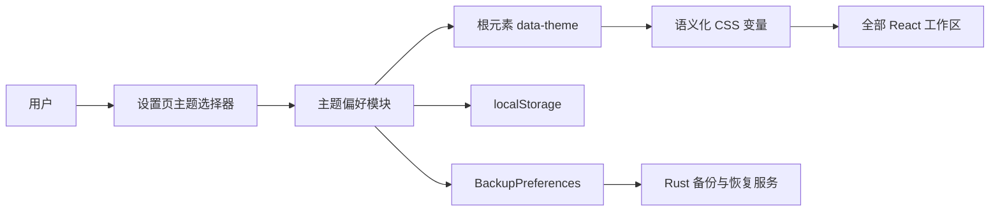

# 资料索引外观主题切换技术设计

Feature Name: `ui-theme-switching`
Updated: 2026-07-26
Status: Confirmed for implementation

## Description

本功能在现有“羊皮卷”主题基础上新增“极简黑白”主题，并在设置页提供即时切换。实现采用语义化 CSS 变量统一颜色和字体，通过根元素 `data-theme` 属性选择主题；主题标识保存在 `localStorage`，并扩展现有 `BackupPreferences` 以支持备份和恢复。

该设计保留现有组件结构和布局，只替换视觉令牌。主题初始化在 React 首次渲染前完成，从而避免启动后先显示默认主题再跳转。字体全部来自 Windows 系统字体栈，不增加网络请求、字体文件或第三方主题依赖。

## Architecture



### Runtime Flow

1. `main.tsx` 在 `createRoot` 前调用主题偏好模块读取并应用主题。
2. `App` 持有当前主题状态，并将主题与更新回调传给设置工作区。
3. 主题选择器调用更新回调，主题偏好模块同步根元素属性和 `localStorage`。
4. 全局样式通过语义化变量自动更新全部组件，无需重新挂载工作区。
5. 备份导出读取当前主题，备份恢复成功后写入并应用恢复主题。

## Components and Interfaces

### Theme Preference Module

新增 `src/features/settings/themePreference.ts`，集中管理主题标识和安全存储访问。

```typescript
export type AppTheme = "parchment" | "minimal";

export const DEFAULT_THEME: AppTheme = "parchment";
export const THEME_STORAGE_KEY = "document-index.appearance-theme";

export function readTheme(): AppTheme;
export function applyTheme(theme: AppTheme): void;
export function saveTheme(theme: AppTheme): void;
```

- `readTheme` 仅接受两个已知标识，未知值回退到 `parchment`。
- `applyTheme` 设置 `document.documentElement.dataset.theme`。
- `saveTheme` 先应用当前会话，再尝试写入 `localStorage`。
- 存储异常由模块内部吸收，主题切换继续在当前会话生效。

### Appearance Settings

新增 `src/features/settings/AppearanceSettings.tsx`，由现有设置工作区渲染。

```typescript
interface AppearanceSettingsProps {
  theme: AppTheme;
  onThemeChange: (theme: AppTheme) => void;
}
```

组件展示两个可访问主题卡片。每张卡片包含名称、简短说明、颜色样本和字体示例，使用 `aria-pressed` 表达当前选择。选择主题只更新外观状态，保留当前设置页及其他业务状态。

### App Shell Integration

`App.tsx` 使用 `useState(readTheme)` 初始化主题。`handleThemeChange` 调用 `saveTheme` 并更新 React 状态；设置工作区接收 `theme` 与回调。根元素属性承担实际样式切换，React 状态用于保持选择器语义状态与备份偏好一致。

### Settings Workspace

现有 `BackupSettings` 扩展为同时承载“外观”和“索引配置备份与恢复”两个区块。组件新增主题 props，并在导出时把主题写入 `BackupPreferences`；恢复成功时调用外观更新回调立即应用恢复值。

### Backup Contract

TypeScript 与 Rust 的备份偏好增加主题字段：

```typescript
export interface BackupPreferences {
  defaultTimeDimension: "modifiedAt" | "createdAt";
  workspaceSplit: number;
  theme: AppTheme;
}
```

```rust
pub struct BackupPreferences {
    pub default_time_dimension: String,
    pub workspace_split: f64,
    #[serde(default = "default_theme")]
    pub theme: String,
}
```

Rust 校验只接受 `parchment` 和 `minimal`。`serde` 默认函数为缺少字段的历史版本备份提供 `parchment`，保持既有备份可恢复。

## Visual Tokens

`global.css` 中现有硬编码颜色和字体逐步替换为语义变量。组件选择变量用途，不直接判断主题。

| Token | 羊皮卷 | 极简黑白 | 用途 |
|------|--------|----------|------|
| `--color-canvas` | `#e8e8e1` | `#f4f4f2` | 应用背景 |
| `--color-surface` | `#f8f7f1` | `#ffffff` | 主要表面 |
| `--color-surface-muted` | `#eeeee7` | `#eceeec` | 次级表面 |
| `--color-sidebar` | `#172521` | `#111311` | 侧栏背景 |
| `--color-text` | `#1d2926` | `#171917` | 主文字 |
| `--color-text-muted` | `#63726d` | `#626762` | 辅助文字 |
| `--color-border` | `#bcc5c0` | `#c9ccc9` | 边框与分隔线 |
| `--color-accent` | `#a8772a` | `#256b52` | 选中与状态强调 |
| `--color-focus` | `#477165` | `#146c53` | 键盘焦点 |
| `--font-body` | Segoe UI 系统栈 | Segoe UI 与微软雅黑系统栈 | 正文与控件 |
| `--font-display` | Georgia 与宋体栈 | Segoe UI 与微软雅黑系统栈 | 标题 |
| `--font-mono` | Consolas 等宽栈 | Cascadia Mono 与 Consolas 栈 | 时间、路径和元数据 |

极简黑白主题减少渐变和半透明纸张纹理，使用纯色表面与 1px 中性边框建立层级。绿色只用于焦点、选中、成功和活动状态，危险状态继续使用克制红色。

## Data Models

| Field | Type | Persistence | Default |
|------|------|-------------|---------|
| `theme` | `"parchment" \| "minimal"` | `localStorage` 与索引配置备份 | `parchment` |

主题字段不进入 SQLite，不影响索引、搜索、扫描或预览数据。主题字段只存在于前端偏好和用户明确导出的 JSON 备份中。

## Correctness Properties

1. **已知主题闭包**：运行时和备份恢复后的主题标识始终属于 `{parchment, minimal}`。
2. **单主题生效**：根元素任一时刻只包含一个 `data-theme` 值。
3. **状态保持**：主题切换不重新挂载当前工作区，不改变搜索、详情、预览和扫描状态。
4. **恢复一致性**：备份恢复结果中的主题、`localStorage` 和根元素主题保持一致。
5. **历史备份兼容**：缺少主题字段的有效历史备份恢复为 `parchment`。

## Error Handling

- `localStorage` 读取失败：使用 `parchment` 并继续启动。
- `localStorage` 写入失败：当前会话继续使用用户刚选择的主题。
- 本机缺少首选字体：CSS 字体栈选择 Windows 后备字体。
- 备份主题值未知：Rust 返回 `INVALID_INPUT`，恢复事务不执行。
- 备份恢复成功但前端存储写入失败：当前会话应用恢复主题，索引恢复结果保持成功。

## Test Strategy

### Frontend Unit and Component Tests

- `themePreference.test.ts` 验证默认值、两个合法值、未知值和存储异常。
- `AppearanceSettings.test.tsx` 验证两张主题卡、当前选择、鼠标与键盘切换。
- `App.test.tsx` 验证启动主题恢复、根元素属性和切换时工作区状态保持。
- `BackupSettings.test.tsx` 验证导出携带主题、恢复后即时应用主题和历史默认值。

### Rust Tests

- 备份导出往返保留 `theme`。
- `parchment` 与 `minimal` 通过偏好校验。
- 未知主题返回 `INVALID_INPUT`。
- 缺少主题字段的历史备份恢复为 `parchment`。

### Visual and Accessibility Verification

- 在桌面宽度和窄屏断点检查两个主题的导航、搜索、版本列表、预览、设置和对话框。
- 使用自动对比度检查验证正文 4.5:1 和大号文字 3:1。
- 使用键盘遍历设置页主题选择器并确认焦点轮廓清晰。
- 验证主题切换前后布局尺寸与当前业务状态保持一致。

## References

- `当前工作区/document-index/src/styles/global.css`：现有全局颜色与字体规则。
- `当前工作区/document-index/src/main.tsx`：React 首次渲染入口。
- `当前工作区/document-index/src/app/App.tsx`：应用外壳与设置工作区状态。
- `当前工作区/document-index/src/features/settings/BackupSettings.tsx`：设置与备份恢复入口。
- `当前工作区/document-index/src/domain/commands.ts`：前端备份偏好契约。
- `当前工作区/document-index/src-tauri/src/services/backup_service.rs`：Rust 备份偏好校验与恢复。
