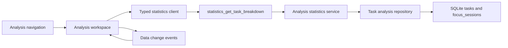

# 工作有效性分析

Feature Name: analysis-workspace
Updated: 2026-09-01

## Description

新增独立分析工作区，使用用户自定义日期范围统计任务完成事件与有效专注投入。第一版复用现有任务、重复实例、项目和专注记录数据，保持 SQLite 为唯一事实来源，并通过类型化 Tauri command 向 React 提供聚合 DTO。

## Architecture



分析查询与现有 `StatisticsService` 并列，任务级明细使用独立 DTO，周期汇总可复用现有统计摘要。任务完成事件从任务与重复实例的完成状态中归属，专注投入从有效 `focus_sessions` 中归属；取消轮次只作为辅助计数返回。

## Components and Interfaces

### Frontend

- `AnalysisWorkspace`: 日期范围、汇总卡片、排序控件、任务统计表格、空状态和错误重试。
- `analysisClient`: 暴露 `getTaskBreakdown(query)` 的类型化命令客户端。
- `analysisModel`: 负责排序、日期校验、格式化和浏览器预览数据。
- `App`: 增加独立 `analysis` 导航目标和工作区渲染分支。

### Rust

- `domain::analysis`: 定义 `AnalysisQuery`、`TaskAnalysisRow`、`AnalysisSummary` 和稳定排序枚举。
- `repositories::analysis_repository`: 使用参数绑定查询任务、任务实例和专注记录，按任务标识聚合。
- `services::analysis_service`: 校验日期范围，组合查询结果，并计算汇总值。
- `commands::analysis`: 注册 `statistics_get_task_breakdown` 或等价的分析命令，复用统一 `CommandResult` 错误结构。

### Proposed command

```ts
type AnalysisQuery = {
  startsOn: string;
  endsOn: string;
  timezone: string;
  sort: "completedCount" | "focusSeconds" | "effectiveSessionCount" | "title";
};

type TaskAnalysisRow = {
  taskId: string;
  taskInstanceCount: number;
  title: string;
  category: string;
  project: CalendarProject | null;
  completedCount: number;
  focusSeconds: number;
  effectiveSessionCount: number;
  cancelledSessionCount: number;
  lastCompletedAt: string | null;
};

type AnalysisSummary = {
  startsOn: string;
  endsOn: string;
  taskCount: number;
  completedCount: number;
  focusSeconds: number;
  effectiveSessionCount: number;
  cancelledSessionCount: number;
  rows: TaskAnalysisRow[];
};
```

## Data Models

- 普通任务通过 `tasks.id` 归属完成事件和专注记录。
- 重复任务通过 `task_instances` 的模板关联与实例标识归属完成事件；具体实例统计可通过 `taskInstanceCount` 保留。
- `focus_sessions.completion_kind` 为 `deadline` 或 `early` 时计入有效专注；`cancelled` 仅计入取消轮次。
- 时间范围使用包含边界的本地日期，Rust 层将日期范围转换为查询时区下的 UTC 半开区间。
- 软移除任务保留有历史记录时可进入分析结果，展示任务标题和历史投入，避免历史统计因当前状态变化而消失。

## Correctness Properties

1. `focusSeconds` 等于统计范围内有效专注记录 `actual_seconds` 的总和。
2. `effectiveSessionCount` 等于统计范围内 `deadline` 与 `early` 记录的数量。
3. `cancelledSessionCount` 等于统计范围内 `cancelled` 记录的数量。
4. 每个专注记录最多归入一个任务统计行。
5. 日期范围查询包含 `startsOn` 与 `endsOn` 的本地日期数据。
6. 所有排序在主字段相同时使用名称和标识作为确定性次序。
7. 汇总字段等于任务明细行对应字段的总和。

## Error Handling

- 日期格式错误返回 `ANALYSIS_DATE_INVALID`，并附带字段名。
- 起止日期顺序错误返回 `ANALYSIS_RANGE_INVALID`。
- 时区无效返回 `ANALYSIS_TIMEZONE_INVALID`。
- 数据库查询失败沿用统一数据库错误映射，前端提供重试入口。
- 空结果返回成功的零值 DTO，前端渲染空状态。

## Test Strategy

- Rust domain tests：日期范围、排序、完成类型归类和零值汇总。
- Rust repository tests：普通任务、重复实例、取消轮次、跨日期时区和软移除历史。
- Rust property tests：随机任务与专注记录组合下验证汇总等于明细总和、记录唯一归属和排序稳定性。
- React component tests：独立入口、自定义范围、日期校验、排序、空状态、失败重试和事件刷新。
- Contract tests：TypeScript DTO、Rust command 注册和字段 camelCase 一致性。
- 运行门禁：`pnpm typecheck`、`pnpm test -- --run`、`pnpm build`，Rust 工具链可用时增加 `cargo fmt --check`、`cargo test` 和 `cargo clippy`。

## References

- `.monkeycode/docs/ARCHITECTURE.md`: 日历、统计、任务和专注数据边界。
- `.monkeycode/docs/INTERFACES.md`: 类型化 command 与统一结果结构。
- `src/features/calendar/StatisticsOverview.tsx`: 现有统计视觉和汇总组件。
- `src-tauri/src/domain/statistics.rs`: 现有周期统计聚合口径。
- `src-tauri/src/repositories/focus_repository.rs`: 专注记录持久化查询边界。
